# data-platform

End-to-end data analytics platform covering ingestion, storage, transformation, and BI.

## Stack

| Layer | Tool |
|---|---|
| Ingestion | AWS Lambda, EventBridge |
| Storage | S3, Snowflake |
| Secrets | AWS Secrets Manager |
| Infrastructure | Terraform |
| Transformation | dbt |
| Serving | Lightdash, Streamlit |
| Language | Python, SQL (Snowflake) |
| CI/CD | GitHub Actions |

## Ingestion Pipelines

| Pipeline | Status | Description |
|---|---|---|
| [gharchive](ingestion/gharchive/README.md) | Active | Hourly GitHub public event ingestion |
| [github-repos](ingestion/github-repos/) | Active | Weekly GitHub repository metadata enrichment |
| openssh-logs | Planned | Security log analytics |

## GitHub analysis pipelines

Two pipelines feed the GitHub analysis layer — hourly event ingestion from GitHub Archive and weekly repository metadata enrichment from the GitHub REST API.



## Live

| Tool | URL |
|---|---|
| Streamlit | [Platform Overview](https://data-platform-f2by2br6nn3zrkbwt6ue8k.streamlit.app/) |
| Lightdash | [GitHub Repo Analyses Overtime](https://eu1.lightdash.cloud/projects/3f159052-6c8d-44e5-86d7-2a8592a503c5/dashboards/4bbebca2-4851-4f19-97ef-94aef52de5b9/view) |

## Running locally

```bash
# provision shared infra first
cd terraform/shared && terraform init && terraform apply

# provision project infra
cd ../gharchive && terraform init && terraform apply -var-file="snowflake.tfvars"

# deploy and test
make deploy && make invoke
```

See individual project READMEs for details.

## S3 bucket strategy

Buckets are split by data classification, not by source:

| Bucket | Classification | Use for |
|---|---|---|
| `s3://data-platform-main-<account_id>/` | General | Public, non-sensitive analytics data |
| `s3://data-platform-restricted-<account_id>/` | Restricted | Security logs, PII, compliance data |