# data-platform

A personal data engineering platform built to learn and iterate on AWS, Terraform, and modern analytics engineering patterns. Multiple ingestion sources feed a shared Snowflake warehouse, dbt project, and Lightdash/Streamlit serving layer.

---

## Stack

| Layer | Tool |
|---|---|
| Ingestion | AWS Lambda (zip deploy), EventBridge |
| Storage | S3 (data lake), Snowflake (warehouse) |
| Infra as code | Terraform |
| Transformation | dbt |
| Orchestration | Airflow |
| Serving | Lightdash, Streamlit |
| Language | Python, SQL (Snowflake) |
| CI/CD | GitHub Actions |

---

## Architecture

### Data flow



### S3 bucket strategy

Both buckets are data lakes. They are separated by **data classification**, not by domain or source. Naming reflects access level, not content type — so the naming stays valid as new sources are added.

| Bucket | Classification | Use for | Controls |
|---|---|---|---|
| `s3://data-platform-main/` | General | Public data, non-sensitive analytics sources | Standard IAM, prefix-scoped per Lambda |
| `s3://data-platform-restricted/` | Restricted | Security logs, PII, compliance data | Separate KMS key, CloudTrail enabled, strict IAM |

`main` is the primary landing zone for general analytics data. `restricted` signals access-controlled data regardless of domain — security logs today, but the name holds if PII from other sources is added later.

### Key design decisions

**Ingestion pattern — time-series, not event-driven**
EventBridge fires at 5 past every hour (after GitHub Archive publishes). Lambda wakes up, fetches the file, writes to S3, goes back to sleep. Pull-based on a fixed schedule because the source publishes on a schedule.

**S3 partitioning — by event time, not ingestion time**
Files land at `raw/gharchive/event_date=YYYY-MM-DD/event_hour=H/`. Partitioned by the hour the data *represents*, not when Lambda ran. `ingested_at` is stored in S3 object metadata so both timestamps are available if needed.

**Snowflake external table, not COPY INTO**
Data stays in S3. Snowflake queries it in place via an external stage. `AUTO_REFRESH = TRUE` with `PARTITION_TYPE = AUTO` means Snowflake reads partition columns directly from the S3 path — no manual partition registration. SQS buffers S3 event notifications so if Snowflake is briefly unavailable, no events are lost.

**dbt materialisation strategy**
Staging layer is a **view** — cheap, always fresh, queries the external table directly. Marts layer is a **table** — materialised so downstream tools (Lightdash, Streamlit) don't hit S3 on every query. Result caching works on native Snowflake tables, not external tables.

**No Docker for Lambda**
Lambda has two dependencies (`requests`, `boto3`). Zip deploy is simpler, faster cold starts, no ECR to manage. Docker gets added back only if a future Lambda needs heavy dependencies (pandas, ML libs, etc).

**Terraform — one folder per project, independent state**
Each ingestion source has its own Terraform folder and state. Shared infrastructure (S3 buckets, KMS keys) lives in `terraform/shared/` and is applied first.

---

## Repo structure

```
data-platform/
├── ingestion/
│   ├── gharchive/               # GitHub Archive ingestion
│   │   ├── handler.py           # Lambda function
│   │   └── requirements.txt
│   └── openssh-logs/            # future — security log ingestion
│       └── ...
├── terraform/
│   ├── shared/                  # S3 buckets, KMS keys — apply first
│   │   ├── main.tf
│   │   ├── variables.tf
│   │   └── outputs.tf
│   ├── gharchive/               # Terraform for gharchive project
│   │   ├── main.tf
│   │   ├── variables.tf
│   │   ├── outputs.tf
│   │   └── modules/
│   │       ├── s3/main.tf
│   │       └── lambda/main.tf
│   └── openssh-logs/            # future — security project
│       └── ...
├── dbt/                         # shared dbt project (all sources)
├── streamlit/                   # Streamlit apps
├── docs/                        # architecture diagrams
├── Makefile
├── README.md
└── CLAUDE.md
```

---

## Projects

### gharchive — GitHub Archive pipeline (active)
Hourly ingestion of GitHub public event data. General analytics data, lands in `s3://data-platform-main/raw/gharchive/`.

See `ingestion/gharchive/` and `terraform/gharchive/`.

### openssh-logs — OpenSSH log analytics (planned)
Security log data. Will land in `s3://data-platform-restricted/` with tighter access controls. Not started yet.

See `ingestion/openssh-logs/` and `terraform/openssh-logs/` when ready.

---

## Phases (gharchive)

### Phase 1 — Ingestion (Lambda + S3) ← current
Provision S3 bucket and Lambda via Terraform. Lambda fetches hourly `.json.gz` from `gharchive.org` and writes to S3 with event-time partitioning. Deployed as a zip package.

### Phase 2 — Snowflake integration (external table + SQS)
Terraform provisions S3 event notifications → SQS → Snowflake external stage + external table with `AUTO_REFRESH`.

### Phase 3 — dbt transformation
Staging view parses nested JSON and filters on partition columns. Marts layer materialises as incremental Snowflake tables.

### Phase 4 — Serving
Lightdash dashboards on top of dbt marts. Streamlit for ad-hoc exploration.

---

## Local setup

### Prerequisites
- AWS CLI configured (`aws configure`)
- Terraform >= 1.5
- Python >= 3.12
- Snowflake account

### Bootstrap

```bash
git clone git@github.com:YOUR_USERNAME/data-platform.git
cd data-platform

# provision shared infra first (S3 buckets, KMS keys)
cd terraform/shared && terraform init && terraform apply

# then provision project-specific infra
cd ../gharchive && terraform init && terraform apply

# deploy Lambda
cd ../..
make deploy

# test Lambda manually
make invoke
```

### Makefile commands

```
make init      # terraform init (run from terraform/gharchive)
make plan      # terraform plan
make apply     # terraform apply
make deploy    # zip and deploy Lambda
make invoke    # trigger Lambda manually for testing
```

---

## Environment variables

| Variable | Description |
|---|---|
| `S3_BUCKET` | Target S3 bucket name |

Never commit `.tfvars` files or AWS credentials. Use `aws configure` or IAM roles.
